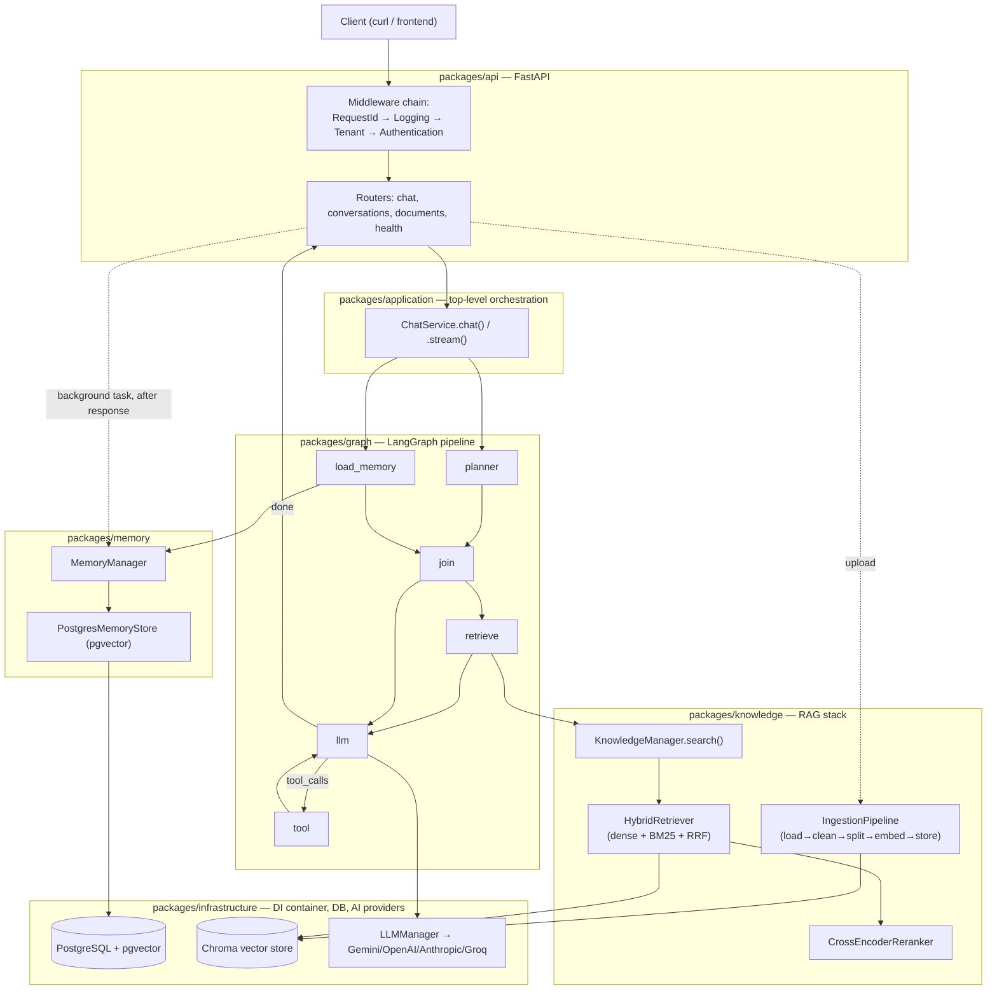

# Architecture Tutorial — How This RAG Platform Actually Works

This is a function-by-function, tutorial-style walkthrough of `langchain-knoledgebase-rag`: what the project is trying to be, and exactly how a request moves through the real, live code to make that happen. It complements [`docs/BUILD_STATUS.md`](./BUILD_STATUS.md) (what's done/broken/pending against the roadmap) and [`docs/CHANGELOG.md`](./CHANGELOG.md) (the narrative of how it got here) — this document is the third leg: **how the system works, mechanically**, for someone reading the code for the first time.

It's organized around real request lifecycles rather than a flat file listing, because that's how the code actually executes: a chat message doesn't care that `packages/knowledge/` has forty files in it, it cares about the six or seven functions it actually passes through on its way to an answer. Each tutorial section traces one lifecycle end to end, naming every function it touches, in the order it's called. A module reference section at the end fills in anything not already covered by a lifecycle walkthrough.

**Companion documents**, each covering something this one deliberately doesn't:

- [`docs/QUICKSTART.md`](./QUICKSTART.md) — hands-on proof: real curl commands and real responses tracing one document through upload → citations → memory recall → streaming.
- [`docs/EXTENDING.md`](./EXTENDING.md) — step-by-step guides for adding a new tool, LLM provider, document loader, or DI-wired service.
- [`docs/TESTING_PLAYBOOK.md`](./TESTING_PLAYBOOK.md) — the manual verification checklist standing in for the automated test suite this project doesn't have yet, plus a troubleshooting procedure for the one failure mode this project has actually hit in practice.
- [`docs/DEPLOYMENT.md`](./DEPLOYMENT.md) — running the full Docker Compose stack, and what's still not production-hardened about it.

---

## Table of Contents

1. [The Goal](#1-the-goal)
2. [Architecture at a Glance](#2-architecture-at-a-glance)
3. [Running It](#3-running-it)
4. [Tutorial: The Chat Request Lifecycle](#4-tutorial-the-chat-request-lifecycle)
5. [Tutorial: The Document Upload & Ingestion Lifecycle](#5-tutorial-the-document-upload--ingestion-lifecycle)
6. [Tutorial: The Retrieval Pipeline (Hybrid Search + Re-ranking)](#6-tutorial-the-retrieval-pipeline-hybrid-search--re-ranking)
7. [Tutorial: The Memory Lifecycle](#7-tutorial-the-memory-lifecycle)
8. [Tutorial: The Streaming Lifecycle](#8-tutorial-the-streaming-lifecycle)
9. [Tutorial: Authentication & Multi-tenancy](#9-tutorial-authentication--multi-tenancy)
10. [Module Reference](#10-module-reference)
11. [Data Model Reference](#11-data-model-reference)
12. [Configuration Reference](#12-configuration-reference)
13. [Dead Code & Known Gaps Map](#13-dead-code--known-gaps-map)

---

## 1. The Goal

This is a multi-tenant, production-shaped **RAG (Retrieval-Augmented Generation) chat platform**: users send messages to `POST /api/v1/chat`, an AI assistant answers them, and the assistant's answers can be grounded in documents the tenant has uploaded (PDFs, DOCX, Markdown, HTML, TXT, and more), with citations back to the source. On top of that base, it also has:

- **Long-term memory** — facts, preferences, and conversation summaries persisted per user, recalled across entirely separate conversations, not just within one session.
- **Tool calling** — the assistant can invoke a calculator, live weather lookup, news search, and web search mid-conversation.
- **Multi-tenancy** — every conversation, document, agent, and memory is scoped to a `tenant_id`, so two tenants never see each other's data.
- **Pluggable LLM/embedding providers** — Google Gemini is the only one currently exercised live, but OpenAI/Anthropic/Groq providers exist behind the same interface.
- **IAM integration** — an external identity service can supply real user identity and RBAC permissions, with the whole system failing open to a default tenant/user when no IAM is configured (so the API stays testable without a running auth service).

The engine underneath all of this is **LangGraph** — the assistant's turn-by-turn behavior (should I retrieve documents? should I call a tool? should I remember this?) is a compiled state graph, not a single hardcoded prompt-and-response call.

---

## 2. Architecture at a Glance



**Layering, outside-in:**

| Layer | Package | Job |
|---|---|---|
| HTTP | `packages/api/` | FastAPI app, routers, middleware, request/response schemas |
| Application | `packages/application/` | `ChatService` — the real top-level entry point that turns an HTTP request into a graph run and a persisted message |
| Conversation | `packages/conversation/` | Builds message history, auto-provisions default agents/conversations |
| Orchestration | `packages/graph/`, `packages/planner/`, `packages/prompts/` | The LangGraph state machine that decides what to do each turn |
| Domain services | `packages/knowledge/`, `packages/memory/`, `packages/tools/` | RAG (ingestion + retrieval), long-term memory, tool execution |
| Infrastructure | `packages/infrastructure/` | Dependency injection container, database/session management, LLM provider adapters, repositories |
| Domain models | `packages/domain/` | SQLAlchemy ORM models — the actual database schema |

Everything is wired together through **`dependency_injector`**: `packages/infrastructure/container/application.py`'s `ApplicationContainer` is the root, composing one sub-container per layer. Understanding the DI container is a prerequisite for understanding how any two classes actually get connected to each other — most classes never construct their own dependencies, they receive them.

---

## 3. Running It

```bash
uv sync                          # install dependencies from pyproject.toml / uv.lock
uv run uvicorn packages.api.app:app --host 127.0.0.1 --port 8000
```

Then open `http://127.0.0.1:8000/docs` for interactive Swagger UI, or:

```bash
curl -X POST http://127.0.0.1:8000/api/v1/chat \
  -H "Content-Type: application/json" \
  -H "X-Tenant-ID: 11111111-1111-1111-1111-111111111111" \
  -H "X-User-ID: 22222222-2222-2222-2222-222222222222" \
  -d '{"message": "Hello!"}'
```

`X-Tenant-ID`/`X-User-ID` are optional — omit them and the app falls back to fixed default UUIDs (`packages/api/dependencies.py`'s `DEFAULT_TENANT_ID`/`DEFAULT_USER_ID`), so you can try the API without hand-generating identifiers first. **Note:** `main.py` at the repo root is a dead legacy stub (imports a `packages/container.py` class that doesn't export what it references) — the real FastAPI app object lives at `packages.api.app:app`, which is what `uvicorn` needs to point at.

---

## 4. Tutorial: The Chat Request Lifecycle

This is the single most important flow in the app: `POST /api/v1/chat`, from HTTP request to persisted, cited response. We'll trace it function by function.

### 4.1 Request enters — middleware chain

Every request first passes through four middlewares, registered in `packages/api/middleware/__init__.py`'s `register_middlewares()`. FastAPI/Starlette runs middleware in **reverse** registration order, so despite being *registered* last, `RequestIdMiddleware` runs **first**:

1. **`RequestIdMiddleware`** (`packages/api/middleware/request_id.py`) — stamps a request ID for log correlation.
2. **`LoggingMiddleware`** (`packages/api/middleware/logging.py`) — logs method/path/status/duration as one structured JSON line per request.
3. **`TenantMiddleware`** (`packages/api/middleware/tenant.py`) — reads `X-Tenant-ID`/`X-Organization-ID` headers, falling back to `DEFAULT_TENANT_ID` (`"00000000-0000-0000-0000-000000000001"`) if absent, and stashes both onto `request.state`.
4. **`AuthenticationMiddleware`** (`packages/api/middleware/authentication.py`) — runs *last* (innermost), so it can override `TenantMiddleware`'s fallback with a real IAM-verified identity when one is available. See [§9](#9-tutorial-authentication--multi-tenancy) for its full logic.

Two more middleware files exist (`rate_limit.py`, `metrics.py`) but are **not registered** — dead code, not part of any live request.

### 4.2 Router — `packages/api/routers/chat.py`

```python
@router.post("", response_model=ApiResponse[ChatResponseSchema])
async def chat(payload: ChatRequestSchema, request: Request, container=Depends(get_scoped_container)):
```

Step by step:

1. `require_uuid_header(request, "X-Tenant-ID", default=DEFAULT_TENANT_ID)` / same for `X-User-ID` — parses the tenant/user IDs off the request (`packages/api/dependencies.py`), falling back to the fixed defaults, raising `400` only if a header is *present but malformed*.
2. **Conversation resolution:**
   - If `payload.conversation_id` was given, `container.repositories.conversation().get(...)` fetches it, raising `404` if it doesn't exist.
   - Otherwise, it auto-provisions: `ensure_default_model_profile()` → `ensure_default_agent()` → `ensure_default_conversation()` (all in `packages/conversation/bootstrap.py`, detailed in §4.3), giving every tenant/user pair a working default conversation without ever calling `POST /conversations` first.
3. Builds a `ChatRequest` DTO (`packages/application/dto/chat.py`) — `tenant_id`, `user_id`, `agent_id`, `session_id`, `conversation_id`, `message`, `stream`.
4. If `payload.stream` is true, returns a `StreamingResponse` wrapping `_sse_events()` (covered in §8) instead of calling the non-streaming path.
5. Otherwise: `response = await chat_service.chat(chat_request)` — this one call is where **everything** interesting happens (§4.4 onward).
6. Wraps the result into `ChatResponseSchema` (`packages/api/schemas/chat.py`: `conversation_id`, `response`, `model`, `usage`, `citations`) inside the standard `ApiResponse` envelope (`packages/api/responses.py`).

### 4.3 Auto-provisioning — `packages/conversation/bootstrap.py`

Three idempotent "get-or-create" functions, all following the same pattern (check for an existing row by a natural key, create one from config defaults if none exists):

- **`ensure_default_model_profile(model_profiles)`** — looks for `ModelProfile.get_default()`, then `get_by_name("default")`, then creates one from `packages.config.ai`'s settings (`settings.ai.default_provider`, `settings.ai.model`, etc.), with a zero-vector placeholder (`[0.0] * settings.embedding.dimensions`) since `ModelProfile.vector` is a `NOT NULL` pgvector column that needs *some* value.
- **`ensure_default_agent(tenant_id, model_profile_id, agents)`** — scoped per-tenant (`agents.get_by_tenant_and_name(tenant_id, "default")`), because `Agent.tenant_id` is required and a single global default agent would leak one tenant's system prompt to every other tenant. The seeded `system_prompt` is the one thing in this file worth reading in full — it's the reason the assistant correctly describes its own memory/RAG capabilities instead of hallucinating "I'm stateless" (see §7 and §13 for the incident that made this prompt what it is today).
- **`ensure_default_conversation(tenant_id, user_id, agent_id, conversations)`** — keyed by a **deterministic** `session_id = f"default-{tenant_id}-{user_id}"`, so repeated `POST /api/v1/chat` calls from the same tenant/user without an explicit `conversation_id` keep landing in the same conversation instead of creating a new one every time.

### 4.4 `ChatService.chat()` — `packages/application/services/chat_service.py`

This is the real top-level orchestrator — the thing that turns one HTTP request into a graph run, a persisted pair of messages, and a committed transaction.

```python
async def chat(self, request: ChatRequest) -> ChatResponse:
    try:
        conversation = await self._get_conversation(request)
        user_message = await self._save_user_message(conversation, request)
        assistant_response, citations = await self._execute_runtime(conversation, user_message, stream=False)
        assistant_message = await self._save_assistant_message(conversation, assistant_response)
        await self._update_conversation(conversation)
        await self._uow.commit()
        return ChatResponse(conversation_id=..., user_message_id=..., assistant_message_id=..., response=..., citations=...)
    except Exception:
        await self._uow.rollback()
        raise
```

Private helpers, each doing exactly one thing:

- **`_get_conversation(request)`** → `ConversationService.get_or_create(...)`.
- **`_save_user_message(conversation, request)`** → `MessageService.create_user_message(...)` — persists the raw user text as a `Message` row (`role=USER`).
- **`_build_state(conversation, stream)`** — assembles the initial `GraphState` dict: fetches the `Agent` (for `system_prompt`/`model_profile_id`/`temperature`/`max_tokens`), calls `ConversationContextBuilder.build()` (§4.5) for message history, and sets all the RAG/memory/tool fields to their empty starting values (`"context": None`, `"citations": []`, `"memories": []`, etc.) — this is also where `"context": None` vs. `state["context"] == []` gets established as a meaningful distinction later (§6.4).
- **`_execute_runtime(conversation, message, stream)`** — calls `GraphManager.invoke(state)` (§4.6 onward), then extracts `result.get("citations") or []` and maps each into a `CitationDTO`, returning `(text, citations)` as a tuple. This is the one function that bridges "a LangGraph state dict" back into "typed objects the rest of the app understands."
- **`_save_assistant_message`**, **`_update_conversation`** — persist the assistant's reply and bump the conversation's `last_message_at`/counters.

### 4.5 `ConversationContextBuilder.build()` — `packages/conversation/context.py`

Loads the conversation's message history from the database and prepends the agent's system prompt as the first message in the list that becomes `state["messages"]`. This is a plain list of `BaseMessage` objects (LangChain's `HumanMessage`/`AIMessage`) — the actual *prompt construction* (folding in memory facts and RAG context) happens later, inside `PromptBuilder` (§4.9), not here. This function's only job is conversation continuity: making sure the LLM sees the whole back-and-forth, not just the latest message.

### 4.6 `GraphManager.invoke()` — `packages/graph/manager.py`

```python
async def invoke(self, state: GraphState) -> GraphState:
    return await self.graph.ainvoke(state, config=self._config(state))
```

`self.graph` is a **compiled LangGraph `StateGraph`**, built once by `GraphBuilder.build()` at container-construction time (§4.7). `_config()` just wraps `state["thread_id"]` (== `conversation_id`) into the `{"configurable": {"thread_id": ...}}` shape LangGraph's checkpointer needs to scope state persistence per conversation.

### 4.7 The graph shape — `packages/graph/builder.py`

`GraphBuilder.build()` constructs the actual state machine:

```
       START
      ┌──┴──┐
      ▼     ▼
  planner  load_memory
      └──┬──┘
         ▼
       join
         │
   (router.route)
   retrieve │ llm
      │     │
 retrieve → llm
         │
  (router.after_llm)
   tool ◄──┤
    │      │
    └─► llm │
           END
```

Six nodes (`planner`, `load_memory`, `join`, `retrieve`, `tool`, `llm`), two conditional-edge decision points (`GraphRouter.route()` after `join`, `GraphRouter.after_llm()` after `llm`), compiled with a checkpointer — wired as a `Singleton` so checkpoints genuinely persist across requests within the process's lifetime (see §13 for why that mattered). The declared default is `MemorySaver` (in-memory), but `packages/api/lifespan.py` overrides it at startup with a real Postgres-backed checkpointer (`create_postgres_checkpointer()`, same file) so checkpoints survive a process restart — the `MemorySaver` default only stays active for code that constructs `ApplicationContainer()` directly without running through `lifespan()`.

**`planner` and `load_memory` run concurrently, not sequentially** — both have a direct edge from `START`. This wasn't always true: they used to run one after the other purely because that's the order the two `add_node` calls happened to be written in, not because `load_memory` needs anything `planner` produces (it only reads the raw last message, never the planner's rewritten query). Running them in parallel cuts whichever of the two calls is faster off every single turn's time-to-first-token. `join` is a trivial pass-through node (`packages/graph/builder.py`'s module-level `_join()`) that exists purely so `router.route()` has a single point to attach to that's guaranteed to run only after **both** branches have actually finished — LangGraph's execution model (Pregel-style supersteps) runs a node once every one of its incoming edges has fired, which is what makes this synchronization safe. A genuine bug surfaced when this was introduced: `LoadMemoryNode` used to mutate the whole `state` dict in place and return it, rather than returning a partial update like every other node — harmless under the old sequential graph (only one node ever ran per step), but under concurrent execution LangGraph read that full-object return as a competing write to *every* key in it, including `rewritten_query` (a key it never actually sets), and raised `InvalidUpdateError`. Fixed by making `LoadMemoryNode` return `{"memories": [...]}` like it always should have.

### 4.8 Node 1 — `planner` (`packages/planner/planner.py`)

`GraphPlanner.__call__(state)` runs first on every turn. Its job: build an `ExecutionPlan` (a list of `ExecutionStep`s, each naming a `Capability` — `MEMORY`, `RETRIEVAL`, `TOOL`, `LLM`, from `packages/planner/models.py`) and decide whether this specific message needs document retrieval at all.

1. Always appends a `MEMORY` step (memory loading always runs).
2. If a `QueryAnalyzer` was injected (it is, via DI — `packages/infrastructure/container/graph.py`'s `query_analyzer` provider), calls `QueryAnalyzer.analyze(state["messages"])` (`packages/planner/query_analyzer.py`) — **one real LLM call** using `LLMManager.with_structured_output(QueryAnalysis)`, where `QueryAnalysis` is a Pydantic model with three fields:
   - `needs_retrieval: bool` — should this turn look anything up?
   - `rewritten_query: str` — the user's message rewritten as a standalone search query, resolving pronouns/context from the last 6 messages of conversation history (e.g. "what about its battery life?" → "What is the battery life of the ZBR-9410?").
   - `expanded_queries: list[str]` (0–3 items) — alternative phrasings to widen retrieval recall.
3. **Fails open**: if the LLM call throws for any reason, it falls back to simple keyword matching (`packages/planner/rules.py`'s `RETRIEVAL_KEYWORDS`) against the raw last message — a classifier hiccup should never crash a turn.
4. If `needs_retrieval`, appends a `RETRIEVAL` step to the plan.
5. Always appends a final `LLM` step.
6. Returns `{"execution_plan": plan, "rewritten_query": ..., "expanded_queries": ...}` — these three keys get merged into `GraphState`.

### 4.9 Node 2 — `load_memory` (`packages/graph/nodes/load_memory.py`)

`LoadMemoryNode.__call__(state)`: takes the last message's content as a query, calls `MemoryManager.search(SearchMemoryRequest(query=..., tenant_id=..., user_id=...))`, and returns `{"memories": [...]}` — a partial state update, not a mutated copy of the whole state (see §4.7's note on why that distinction became load-bearing once this node started running concurrently with `planner`). Full mechanics in §7. Runs **in parallel with `planner`** (§4.7), both starting directly from `START`.

### 4.10 Join, then decision point — `join` and `GraphRouter.route()` (`packages/graph/builder.py`, `packages/graph/router.py`)

`join` (module-level `_join(state)` in `builder.py`) does nothing but return the state unchanged — its only purpose is being the point both `planner` and `load_memory` converge on before routing, guaranteeing `route()` never reads `state["execution_plan"]` before `planner` has actually written it:

```python
def route(self, state: GraphState) -> str:
    if state["execution_plan"].has(Capability.RETRIEVAL):
        return "retrieve"
    return "llm"
```

Straightforward: does the plan built in §4.8 include a `RETRIEVAL` step? If yes, go to `retrieve`; otherwise skip straight to `llm`.

### 4.11 Node 3 (conditional) — `retrieve` (`packages/graph/nodes/retrieve.py`)

Only runs if the planner decided retrieval was needed. Full mechanics in §6 — the short version: searches the rewritten query plus every expansion variant through the hybrid retriever, merges/dedupes/reranks, and populates `state["context"]`, `state["search_results"]`, `state["citations"]`.

### 4.12 Node 4 — `llm` (`packages/graph/nodes/llm.py`)

`LLMNode.__call__(state)`:

1. `PromptBuilder.build(system_prompt=..., memories=..., context=..., messages=...)` — assembles the final message list sent to the model (§4.13 — this is where memory facts and RAG context actually enter the prompt).
2. Builds a `ChatRequest` (note: this is `packages.chat.request.ChatRequest`, a **different** class from `packages.application.dto.chat.ChatRequest` used at the HTTP layer — an intentional two-layer split, described in §13) with `tools=self._tools.list()` if `state.get("tools_enabled", True)`.
3. If `state.get("stream")`, delegates to `self._stream(request)` (§8); otherwise `await self._chat.chat(request)` where `self._chat` is `packages.chat.chat_service.ChatService` — a **second, internal** `ChatService` class, distinct from the application-layer one in §4.4. This internal one's whole job is talking to the LLM:
   ```python
   def _model(self, request):
       return self._llm.bind_tools(request.tools) if request.tools else self._llm
   async def chat(self, request):
       response = await self._model(request).ainvoke(request.messages)
       return ChatResponse(message=response, usage=response.usage_metadata or {}, ...)
   ```
   `bind_tools()` is what gives the model real tool-calling capability — without this call, the model has zero ability to actually invoke `calculator`/`get_weather`/etc., no matter how convincingly it might otherwise claim to.
4. `normalize_message_content()` (`packages/shared/messages.py`) flattens Gemini's occasionally list-shaped `AIMessage.content` back into a plain string (a real bug fixed earlier this project's history — Gemini can return content as a list of content blocks, which breaks naive string handling downstream).
5. Appends the new `AIMessage` to `state["messages"]` and merges `state["usage"]` (via `GraphState`'s `merge_usage` reducer, so multiple LLM calls within one turn — e.g. once before a tool call, once after — sum their token counts instead of the second overwriting the first).

### 4.13 `PromptBuilder.build()` — `packages/prompts/builder.py`

This is where the final prompt actually gets assembled — and it's had a real, live bug fixed in it (see §13's hallucination incident). Current logic:

```python
def build(self, *, system_prompt, memories, context, messages):
    sections = [system_prompt]
    if memories:
        sections.append(f"Known facts about the user, from long-term memory (not written by the user in this message):\n\n{memory_text}")
    if context is not None:
        budgeted = self._dedup_and_budget(context) if context else []
        if budgeted:
            sections.append(f"Relevant knowledge retrieved from the knowledge base for this specific question (not written by the user...):\n\n{context_text}")
        else:
            sections.append("The knowledge base was searched for this specific question and no matching documents were found. ... do not invent a public/web search you did not perform.")
    template = ChatPromptTemplate.from_messages([("system", "{system_prompt}"), MessagesPlaceholder("conversation")])
    return template.invoke({"system_prompt": "\n\n---\n\n".join(sections), "conversation": messages}).to_messages()
```

Two design decisions worth calling out explicitly:

1. **Everything folds into one `system` message**, not separate `human` turns. An earlier version injected memory/context as their own `("human", ...)` template entries — which the model read as *the user having typed that content*, producing responses like "it appears **you** have provided some information regarding...". Folding it into the system message with explicit "(not written by the user)" labeling fixed that misattribution.
2. **`context is not None` vs. `context == []` are different states**, checked explicitly. `None` means retrieval never ran this turn (the planner decided it wasn't needed) — say nothing about the knowledge base. `[]` means retrieval *ran* and found nothing relevant — say so plainly, and explicitly instruct the model not to fabricate a "searched public records" narrative for what was actually an empty internal KB lookup.

`_dedup_and_budget(context)` drops exact-duplicate chunks (multi-query retrieval can easily surface the same chunk more than once) and truncates to `settings.rag.context_token_budget` (default 4000) tokens via `tiktoken.get_encoding("cl100k_base")`, so a large merged/reranked context can't blow out the prompt.

### 4.14 Decision point — `GraphRouter.after_llm()` (`packages/graph/router.py`)

```python
def after_llm(self, state: GraphState) -> str:
    if getattr(state["messages"][-1], "tool_calls", None):
        return "tool"
    return END
```

If the model's response includes `tool_calls` (LangChain populates this automatically when `bind_tools()` was used and the model chose to call one), route to `tool`; otherwise the turn is done and the graph ends here — **not** at an `extract_memory` node anymore (see the note below).

### 4.15 Node 5 (conditional) — `tool` (`packages/graph/nodes/tool.py`)

`GraphToolNode` is a thin wrapper around LangGraph's prebuilt `ToolNode(tools=tool_manager.list())` — it executes whichever tool(s) the model called, appends the `ToolMessage` results to state, and the graph loops back to `llm` so the model can see the tool's output and produce a final answer.

### 4.16 Memory extraction moved out of the graph entirely

There used to be a sixth node here, `extract_memory`, sitting between `llm` and `END` — it ran once the model's final answer was ready and called `MemoryManager.extract()` then `.summarize()` (§7.2/§7.3) **synchronously, as part of the graph LangGraph's `invoke()` awaits to completion.** That meant every single turn's HTTP response was blocked on two more full LLM calls (fact extraction, then summarization) that have zero effect on the reply the user is actually waiting for — measured to add several real seconds to every turn, retrieval-routed or not.

It's now a **background task**, scheduled by the chat router (`packages/api/routers/chat.py`'s `_extract_memory_in_background()`) *after* the response has already been sent — the same "never block the request path" pattern this codebase already used for document ingestion (`packages/api/routers/documents.py`'s `_ingest_in_background`). It reuses `ExtractMemoryNode` directly (still a real class, `packages/graph/nodes/extract_memory.py` — just no longer wired into `GraphBuilder`/`GraphNodes`, constructed instead via `container.graph.extract_memory()`), opens its **own fresh** request-scoped DB session (the original request's session may already be closed by the time a background task runs), and rebuilds the message history via `ConversationContextBuilder` rather than threading LangChain message objects out of the graph — both the user's and the assistant's messages are already committed to the DB by then, so a fresh rebuild sees exactly what the graph saw. Wired into both the non-streaming path (scheduled right after `chat_service.chat()` returns) and the streaming path (scheduled after the SSE token loop finishes, just before the terminal `"done"` event).

**A real concurrency bug this move surfaced, found and fixed the same session:** `MemoryManager.summarize()` does a check-then-act — "does a summary row exist for this conversation yet? If not, create one; if so, update it." Under the old synchronous graph this was implicitly safe (one turn's whole pipeline, extraction included, always finished before the next request's turn could start). Once extraction became a background task, two turns close together in the same conversation could race: both check "no summary yet," both try to create one, corrupting the one-summary-per-conversation invariant and crashing every later summarization for that conversation with `MultipleResultsFound`. Fixed with a per-conversation `asyncio.Lock` (`packages/memory/manager.py`'s module-level `_summary_locks`) guarding the check-then-act, plus making the fetch itself defensive (`MemoryRepository.get_by_conversation_and_type()` now takes the most recently updated row instead of crashing if duplicates ever exist for any reason).

### 4.17 Back to the router — the response

Once the graph run completes, `GraphManager.invoke()` returns the final `GraphState` dict. `ChatService._execute_runtime()` pulls `result["messages"][-1].content` (the assistant's text) and `result.get("citations")` out of it, and the chain unwinds back up through §4.4's `ChatService.chat()`, which persists the assistant message, commits the transaction, and returns a `ChatResponse` DTO. The router (§4.2) wraps that into the final `ChatResponseSchema`, **schedules the memory-extraction background task described in §4.16**, and the HTTP response goes out — the client gets its reply without waiting on memory bookkeeping at all.

---

## 5. Tutorial: The Document Upload & Ingestion Lifecycle

### 5.1 `POST /api/v1/documents` — `packages/api/routers/documents.py`

```python
@router.post("", status_code=202, response_model=ApiResponse[DocumentUploadResponseSchema])
async def upload_document(request, background_tasks, file: UploadFile, chunking_strategy="auto", container=Depends(get_scoped_container)):
```

1. Resolves tenant/user IDs (same pattern as chat).
2. `ensure_default_knowledge_base(tenant_id, knowledge_bases)` (`packages/knowledge/bootstrap.py`) — auto-provisions a per-tenant `KnowledgeBase` row, mirroring `conversation/bootstrap.py`'s idiom.
3. `ensure_default_model_profile(model_profiles)` — reused from `packages/conversation/bootstrap.py`.
4. **Uploads the file bytes to the Upload Service** via `container.upload.client().uploads.upload(...)` (`packages/sdk/upload/`, wired in `packages/infrastructure/container/upload.py` the same way IAM's SDK client is wired). This is the durable copy — a separate microservice, deliberately outside this app, so raw document bytes don't accumulate in this app's own local disk indefinitely. Returns a real `UploadedFile` with a real `id`; a connection or non-2xx failure here is fatal to the request (`502`, not a silent local-disk fallback) since the whole point of this service is to be the actual source of truth for the bytes.
5. Writes the same bytes to a **local scratch copy** at `settings.storage.temp_directory / f"{uuid4()}_{file.filename}"` — needed only because the loader/splitter pipeline (§5.2) reads from a real local `Path`; deleted again once ingestion finishes (step 7), so it never accumulates.
6. Builds an `IngestionRequest` (`packages/knowledge/schemas.py`): `tenant_id`, `model_profile_id`, `knowledge_base_id`, `file` (the scratch path), `file_id` (the Upload Service's real `id` — flows straight into `Document.file_id`, previously always a throwaway `uuid4()` with nothing behind it), `document_name`, `chunking_strategy`.
7. `background_tasks.add_task(_ingest_in_background, container, ingestion_request, scratch_path)` — schedules the actual work **off the request path**, then immediately returns `202 Accepted` with `DocumentUploadResponseSchema(status=PENDING, document_name=..., file_id=...)`. The caller doesn't wait for embedding work to finish.
8. `_ingest_in_background()` opens its **own fresh** `request_scoped_session(container)` rather than reusing the original request's — a background task runs *after* the HTTP response is sent, by which point the original request's session may already be closed (same reasoning documented in `packages/api/dependencies.py`) — and deletes the scratch copy in a `finally` block regardless of whether ingestion succeeded, failed, or was skipped as a duplicate.

Re-uploading identical content still gets a **new** Upload Service file record each time (the remote service doesn't dedup at the storage layer) but is still correctly skipped for re-indexing by the checksum check in §5.2 — storage durability and indexing-cost avoidance are separate concerns here, not the same check.

### 5.2 `IngestionPipeline.ingest()` — `packages/knowledge/pipelines/ingestion.py`

The real work, in order:

1. **Checksum check (incremental indexing)** — computes a SHA-256 hash of the file's bytes and checks `DocumentRepository.get_by_checksum()` scoped to the knowledge base. If a match exists, returns immediately with `IngestionResponse(skipped=True, chunk_count=0, ...)` — no re-load, no re-embed, no re-store. This is what makes re-uploading the same file idempotent.
2. **Load** — `DocumentLoaderManager` (`packages/knowledge/loaders/manager.py`) picks a loader by file extension (`packages/knowledge/loaders/{pdf,docx,markdown,html,text,json,csv}.py`) and produces LangChain `Document` objects with real extracted metadata (PDF/DOCX give `author`/`page` natively or via `python-docx`'s `core_properties`).
3. **Clean** — `DocumentCleaner` (`packages/knowledge/processors/cleaner.py`) normalizes whitespace/encoding artifacts.
4. **Split** — `SplitterFactory.create(chunking_strategy)` (`packages/knowledge/splitters/factory.py`) picks between:
   - `RecursiveDocumentSplitter` — standard `RecursiveCharacterTextSplitter`-style chunking, the default for anything that isn't Markdown.
   - `MarkdownDocumentSplitter` — two-stage: `MarkdownHeaderTextSplitter` first (so chunks carry `h1`/`h2` heading metadata), then a recursive size cap within each section.
   - `SemanticDocumentSplitter` — hand-rolled: splits into sentences, embeds every sentence in one batch call, computes consecutive-sentence cosine distances, and breaks at the 95th-percentile distance (`statistics.quantiles`) — i.e. it cuts where the topic actually changes, not at an arbitrary character count. Oversized resulting chunks get a recursive fallback split. Opt-in only (`chunking_strategy="semantic"`), since it's meaningfully more expensive (embeds every sentence).
5. **Token counting** — `tiktoken.get_encoding("cl100k_base").encode(chunk)` gives each chunk a real `token_count`, used later for `PromptBuilder`'s context budget.
6. **Embed** — `EmbeddingManager` (`packages/knowledge/embeddings/manager.py`) calls the configured provider's `aembed_documents()` **once, batched**, for all chunks in the document — not once per chunk in a loop (confirmed via a call-count check: a 20-chunk document produces exactly 1 embedding API call).
7. **Store** — writes chunk content + metadata into the vector store (`VectorStoreManager` → `ChromaVectorStore` by default) and bookkeeping rows (`Document`, `DocumentChunk`) into Postgres. **Chunk content itself lives only in the vector store** — Postgres's `Document`/`DocumentChunk` rows are identity/checksum/status bookkeeping, a deliberate scope decision to avoid duplicating content across two stores.
8. Returns `IngestionResponse(document_id, chunk_count, embedding_count, skipped=False)`.

---

## 6. Tutorial: The Retrieval Pipeline (Hybrid Search + Re-ranking)

This is what runs inside the `retrieve` node (§4.11) whenever the planner decides a turn needs document lookup — the most recently completed major piece of this project (Production Retrieval, Phase 9).

### 6.1 `RetrieveNode.__call__()` — `packages/graph/nodes/retrieve.py`

```python
primary_query = state.get("rewritten_query") or state["messages"][-1].content
queries = [primary_query, *state.get("expanded_queries", [])]
```

1. For **each** query (the rewritten primary query plus every expansion variant the planner generated), calls `KnowledgeManager.search(query=..., filters=SearchFilter(tenant_id=..., model_profile_id=...), options=SearchOptions(limit=10))`.
2. **Merges** all the per-query result lists into one dict keyed by `chunk.id`, keeping the highest score seen for each chunk across every query variant — so the same chunk surfaced by two differently-phrased queries doesn't get double-counted, and gets credit for its best match.
3. **Reranks** the merged candidate pool via `CrossEncoderReranker.rerank(primary_query, candidates, top_k=settings.rag.max_results)` (§6.4).
4. **Filters by relevance floor**: `reranked = [r for r in reranked if r.score >= settings.rag.min_relevance_score]` (default `0.0`) — cross-encoder scores are unbounded, not probabilities, so with a small candidate pool the single best-available match can still be a confidently *irrelevant* one; this floor drops those before they become a misleading citation.
5. Populates three `GraphState` fields:
   - `context: list[str]` — just the chunk text, what `PromptBuilder` folds into the prompt.
   - `search_results: list[SearchResult]` — the flat `packages.knowledge.schemas.SearchResult` shape (`document_id`, `chunk_id`, `chunk_index`, `content`, `score`) — note this is a **different class** from `packages.knowledge.vectorstores.schema.SearchResult` (nested `chunk: DocumentChunk` object), which is what the retrievers actually return; mapping between the two is an explicit field-extraction step here.
   - `citations: list[Citation]` — same fields minus `content`, what eventually reaches the HTTP response.

### 6.2 `KnowledgeManager.search()` — `packages/knowledge/manager.py`

```python
async def search(self, query, filters, options=None):
    query_embedding = await self.embedding_manager.embed_query(query)
    request = RetrievalRequest(query_embedding=query_embedding, filters=filters, query=query, options=options)
    return await self.retriever_manager.retrieve(request)
```

Embeds the query text, then delegates to whichever retriever the DI container wired up. `RetrievalRequest` carries **both** the embedding (for dense search) **and** the raw query string (for BM25) — this dual carriage is what lets a single retriever implementation do hybrid search without a second round-trip.

### 6.3 `HybridRetriever.retrieve()` — `packages/knowledge/retrievers/providers/hybrid.py`

The default retriever (`settings.rag.retrieval_strategy = "hybrid"`, selected by `RetrieverFactory.create()`), doing real reciprocal-rank-fusion of dense + keyword search:

1. **Dense leg**: `vector_store.similarity_search(query_embedding, filters, options)` — standard cosine-similarity vector search (Chroma or pgvector, whichever backend is configured).
2. **Keyword leg**: fetches a bounded candidate pool via the new `vector_store.list_chunks(filters, limit=500)` method (added specifically to support this — an unranked bulk fetch, not a similarity search), tokenizes each chunk's content and the query with a simple `[a-z0-9]+` regex, and scores them with `rank_bm25.BM25Okapi.get_scores()`.
3. **Fusion**: for each of the two ranked lists, every result at rank `r` (0-indexed) contributes `1 / (60 + r + 1)` to that chunk's fused score (`RRF_K = 60`, the standard constant); a chunk appearing in both lists gets both contributions summed. Chunks are then sorted by fused score, descending, and the top `limit` returned.

This means a chunk that's the *only* place a specific exact-match term (a product code, an acronym) appears — which dense embedding similarity can blur past — still gets pulled into the top results via its BM25 rank, even if dense search's own top-K never included it at all. **Trade-off, deliberately accepted:** the BM25 index (`BM25Okapi`) is rebuilt from scratch on every single search call over whatever the candidate pool returns — fine at small/medium data scale, would need a persisted/incremental index at real production scale.

### 6.4 `CrossEncoderReranker.rerank()` — `packages/knowledge/reranking/cross_encoder.py`

```python
async def rerank(self, query, results, top_k):
    return await asyncio.to_thread(self._rerank_sync, query, results, top_k)
def _rerank_sync(self, query, results, top_k):
    model = self._get_model()  # lazy-loads sentence_transformers.CrossEncoder on first call
    pairs = [(query, r.chunk.content) for r in results]
    scores = model.predict(pairs)
    return [SearchResult(chunk=r.chunk, score=float(s)) for s, r in sorted(zip(scores, results), reverse=True)[:top_k]]
```

A cross-encoder scores `(query, document)` pairs **directly** (feeding both into the same transformer forward pass), which is more accurate than comparing two independently-computed embedding vectors — at the cost of being slower and only feasible on a small candidate pool, which is exactly why it runs as a *second* pass after the (cheap, large-scale) hybrid search narrows things down first.

Two implementation details worth understanding:

- **Lazy model loading**: the `sentence_transformers.CrossEncoder("cross-encoder/ms-marco-MiniLM-L-6-v2")` model (a ~90MB download on first use) is only constructed inside `_get_model()`, the first time `rerank()` is actually called — not in `__init__`. This means wiring `CrossEncoderReranker` as a DI singleton at container-build time (which happens at every app startup) never triggers the download; only the first real chat turn that reaches retrieval does.
- **`asyncio.to_thread`**: `CrossEncoder.predict()` is synchronous, CPU-bound Python — calling it directly inside an `async def` would block the entire event loop for every other concurrent request. Running it in a thread pool via `to_thread` keeps the server responsive to other requests while a rerank is in flight.

---

## 7. Tutorial: The Memory Lifecycle

Two separate flows: loading memory at the *start* of a turn (still a real graph node, running in parallel with `planner` — §4.7/§4.9), and extracting new memory at the *end* of one (no longer a graph node at all — a background task scheduled after the response is sent, §4.16).

### 7.1 Loading — `LoadMemoryNode` → `MemoryManager.search()` → `PgVectorMemoryRetriever`

`packages/memory/implementations/pgvector_retriever.py`'s `PgVectorMemoryRetriever.search()`:

```python
query_vector = await self._embeddings.client.aembed_query(request.query)
rows = await self._repository.search_similar(tenant_id=..., user_id=..., query_vector=..., k=request.top_k)
```

Embeds the current message, then does a real pgvector cosine-similarity search against the `memories` table (`packages/domain/models/memory.py`), scoped to `tenant_id`/`user_id` — so memory recall genuinely works **across separate conversations** for the same user, not just within one conversation's history. Each row maps back to a `MemoryFact` dataclass (`packages/memory/schemas.py`).

### 7.2 Extraction — `ExtractMemoryNode` → `MemoryManager.extract()` → `LLMMemoryExtractor`

**Runs as a background task now, not a graph node** — see §4.16 for the full story on why and how (`packages/api/routers/chat.py`'s `_extract_memory_in_background()`, scheduled after the response is sent). `ExtractMemoryNode.__call__(state)` itself is unchanged: it still takes a plain dict with `conversation_id`/`tenant_id`/`user_id`/`messages` and calls `MemoryManager.extract()` then `.summarize()` in sequence — it just receives that dict from the chat router's background task now, constructed via `container.graph.extract_memory()`, instead of from the compiled graph passing it the live `GraphState`.

`packages/memory/implementations/llm_extractor.py`'s `LLMMemoryExtractor` is a real LCEL chain:

```python
self._chain = _EXTRACTION_PROMPT | llm.model | MemoryFactListParser()
```

`_EXTRACTION_PROMPT` instructs the model to extract only durable information (preferences, goals, skills, projects, profile facts) as a JSON list, each item typed as one of `fact`/`preference`/`profile`/`task`/`summary`/`goal`/`skill`/`project`. `MemoryFactListParser` (`packages/memory/implementations/output_parser.py`) is a custom `BaseOutputParser` subclass parsing that JSON into typed dicts, replacing a much earlier `json.loads()`-based version. `MemoryManager.extract()` then wraps each item into a `CreateMemoryRequest` and calls `PostgresMemoryStore.create_many()`, which embeds each fact's content and inserts a real row.

**A known, currently-unfixed gap in this exact chain, found via a real production incident:** the extraction prompt has no instruction excluding the *model's own claims about its own capabilities* from being captured as durable facts. If the model answers a capability question incorrectly in one turn (e.g. wrongly claiming to be stateless), that wrong claim can get extracted and stored as a `FACT` — and because memory is recalled into every future conversation for that user, the error becomes self-reinforcing: every later turn recalls the wrong "fact" and answers consistently with it. See §13 for the incident and cleanup.

### 7.3 Summarization — `MemoryManager.summarize()` → `LLMMemorySummarizer`

`packages/memory/implementations/llm_summarizer.py`: a second, simpler LCEL chain (`_SUMMARY_PROMPT | llm.model`, no structured-output parser needed since it just returns prose) that produces one running narrative summary of the conversation. `MemoryManager.summarize()` checks `get_by_conversation_and_type(conversation_id, MemoryType.SUMMARY)` first — if a summary row already exists for this conversation, it **updates it in place** rather than inserting a new one, so a long conversation accumulates one evolving summary, not an ever-growing pile of near-duplicate rows.

**This check-then-act is guarded by a per-conversation `asyncio.Lock`** (`packages/memory/manager.py`'s module-level `_summary_locks: dict[UUID, asyncio.Lock]`). It wasn't always — this raced for real once extraction became a background task (§4.16): two turns close together in the same conversation could both read "no summary yet" before either had created one, both insert a row, and permanently break every later summarization for that conversation (`get_by_conversation_and_type()` crashing with `MultipleResultsFound` once two rows existed). The lock is process-wide and keyed by `conversation_id` on purpose — `MemoryManager` itself is a per-call `providers.Factory`, so a lock stored as an instance attribute wouldn't serialize anything, a fresh instance (and a fresh lock) would be constructed every call. `MemoryRepository.get_by_conversation_and_type()` (`packages/infrastructure/repositories/memory.py`) is also defensive now regardless — it takes the most recently updated row via `.order_by(updated_at.desc()).limit(1)` instead of `scalar_one_or_none()`-and-crash, so even a duplicate that somehow slips past the lock degrades gracefully instead of breaking the conversation permanently.

---

## 8. Tutorial: The Streaming Lifecycle

### 8.1 Router — `_sse_events()` (`packages/api/routers/chat.py`)

```python
async def _sse_events(chat_service, chat_request, conversation_id, background_tasks, container, tenant_id, user_id, system_prompt):
    async for token in chat_service.stream(chat_request):
        yield f"data: {json.dumps({'type': 'token', 'content': token})}\n\n"
    background_tasks.add_task(_extract_memory_in_background, container, conversation_id, tenant_id, user_id, system_prompt)
    yield f"data: {json.dumps({'type': 'done', 'conversation_id': str(conversation_id)})}\n\n"
```

Wrapped in a `StreamingResponse(media_type="text/event-stream")` when `payload.stream` is true. Memory extraction (§4.16) is scheduled here too, right after the token loop finishes and just before the terminal `"done"` event — streaming turns get the same "don't block on memory bookkeeping" treatment as non-streaming ones. Citations are **not** included in either event type — a known, documented gap (`ChatService.stream()` never threads them through), not an oversight in this specific change.

### 8.2 `ChatService.stream()` (`packages/application/services/chat_service.py`)

Mirrors `.chat()`'s flow (get conversation → save user message) but instead of one `_execute_runtime()` call, iterates `self._stream_runtime(conversation, user_message)`, accumulating chunks into a list and yielding each one immediately, then joins and persists the full assistant message once the stream completes.

### 8.3 `GraphManager.stream()` (`packages/graph/manager.py`)

```python
async for event in self.graph.astream(state, config=self._config(state), stream_mode="custom"):
    yield event
```

`stream_mode="custom"` is required here specifically — LangGraph's default `"updates"` mode only yields one event per whole node *completion*, not per token; `"custom"` is what surfaces the events pushed by `get_stream_writer()` inside `LLMNode._stream()` (§4.12), one per token as the model generates them.

**Known, deliberate gap:** citations are **not** threaded through this path. `LLMNode._stream()` yields raw token content only — `retrieve` still runs beforehand and populates `state["citations"]` exactly as in the non-streaming path, but nothing in the SSE event shape currently carries them to the client. Would need a second SSE event type (e.g. a final `{"type": "citations", ...}` event) to close this gap.

---

## 9. Tutorial: Authentication & Multi-tenancy

### 9.1 Two independent identity signals, one wins

`TenantMiddleware` (§4.1) always resolves *something* for `request.state.tenant_id`/`user_id` — real header or a fixed default — so the API is always minimally usable. `AuthenticationMiddleware` runs after it and can **override** those values, but only with a genuinely IAM-verified identity:

```python
current_user = await auth_service.resolve(access_token)
if current_user is not None:
    request.state.current_user = current_user
    request.state.tenant_id = str(current_user.tenant_id)
    request.state.user_id = str(current_user.id)
```

### 9.2 `AuthService.resolve()` — `packages/auth/service.py`

```python
async def resolve(self, access_token):
    if not access_token:
        return None
    try:
        return await self._client.auth.get_current_user(access_token)
    except (SDKException, httpx.HTTPError) as exc:
        logger.warning("IAM auth failed, falling back to default identity", error=str(exc))
        return None
```

**Fails open, by explicit design**: no token, an unreachable IAM service, or a rejected token all produce the same outcome — `None`, logged, with the existing tenant/user fallback left untouched. Real enforcement (§9.3) only ever activates once a token is genuinely verified; nothing about auth failure ever blocks a request outright.

### 9.3 `IAMClient` — `packages/sdk/iam/`

`packages/sdk/iam/client.py`'s `IAMClient` is a facade composing three sub-clients, all built on a shared `httpx.AsyncClient` (`packages/infrastructure/http/client.py`'s `create_http_client()`) and `packages.config.iam.IAMSettings`:

- **`IAMAuthSDK`** (`auth.py`) — `get_current_user(access_token)` calls the real IAM `/me` endpoint with the bearer token, returning a `CurrentUser` Pydantic model (`id`, `tenant_id`, `roles`, `permissions`). Also has `get_service_token()` (client-credentials grant) and `introspect(session_id)` for session validation.
- **`IAMUsersSDK`** (`user.py`), **`IAMTenantsSDK`** (`tennets.py`) — user/tenant management endpoints, not exercised on the hot chat path.

### 9.4 Permission enforcement — `require_permission()`/`require_role()` (`packages/api/dependencies.py`)

FastAPI dependency **factories** (not dependencies themselves — you call them to get one):

```python
def require_permission(code: str):
    async def _check(current_user: CurrentUser | None = Depends(get_current_user)):
        if current_user is None:
            return  # fail open — no verified user, no enforcement
        if not any(p.code == code for p in current_user.permissions):
            raise HTTPException(403, f"Missing required permission: {code}")
    return _check
```

Used as `Depends(require_permission("documents:write"))` on a route. Consistently fails open — matches `AuthenticationMiddleware`'s design: enforcement is additive once real auth is flowing, never a hard requirement that would break the API when IAM isn't configured.

### 9.5 Swagger discoverability — `packages/api/security.py`

`tenant_scheme` (`APIKeyHeader`) and `bearer_scheme` (`HTTPBearer`) are declared purely so Swagger UI's "Authorize" dialog shows both a **Tenant** and an **Authorization** field. Neither dependency (`get_tenant_id`/`get_bearer_token`) performs real validation — the actual tenant-fallback logic lives in `TenantMiddleware`, and the actual auth/fail-open logic lives in `AuthenticationMiddleware`, both of which read the raw headers themselves. These two functions exist for OpenAPI documentation, not enforcement.

---

## 10. Module Reference

Everything not already fully covered by a lifecycle tutorial above, organized by package. Only functions that do real work are listed — pure boilerplate (empty `__init__.py`, one-line dataclass fields) is skipped.

### `packages/api/`
- **`app.py`** — `create_application()`: the FastAPI factory. Wires middleware → exception handlers → routers, in that order, then returns the `app` object `uvicorn` serves.
- **`lifespan.py`** — `lifespan()`: an `@asynccontextmanager` run once at startup/shutdown. On startup: builds the `ApplicationContainer`, calls `GraphVisualizer.save_png()` (wrapped in `try/except` — rendering failure never blocks startup), then `Base.metadata.create_all()` against the real DB engine (idempotent schema creation, not a migration tool). On shutdown: disposes the DB engine and calls `container.unwire()`.
- **`dependencies.py`** — see §4.2/§9.4. Also: `request_scoped_session()` (the transaction-boundary context manager every mutating request goes through), `get_scoped_container()` (the FastAPI dependency wrapping it).
- **`exception_handlers.py`** — three handlers (validation errors → `422`, `HTTPException` → its own status code, anything else → `500`), all wrapping the response in the shared `ErrorResponse` schema. In debug mode (`settings.app.debug`), the `500` handler includes the full traceback in the response body.
- **`responses.py`** — `ApiResponse[T]` (the `{success, message, data, metadata, timestamp}` envelope every successful endpoint returns) and `ErrorResponse`.
- **`routers/health.py`** — `GET /health`: pings the DB (`SELECT 1`) and Redis (`.ping()`) independently, returns `"healthy"`/`"degraded"` based on both.
- **`routers/conversations.py`** — beyond `POST /conversations` (§4.3): `GET /conversations/{id}` (single conversation metadata) and `GET /conversations/{id}/messages` (paginated, oldest-first message history via `MessageRepository.list_by_conversation()`/`.count_by_conversation()`). Both are tenant-scoped — a conversation belonging to a different tenant 404s exactly like a nonexistent one, so existence can't be leaked to a non-owner.
- **Routers that exist but are NOT wired**: `feedback.py`, `knowledge_bases.py`, `models.py`, `prompts.py`, `search.py`, `tools.py` — all commented out in `packages/api/routers/__init__.py`. Real files, zero live traffic.

### `packages/planner/`
- **`models.py`** — `Capability` (`StrEnum`: `MEMORY`/`RETRIEVAL`/`TOOL`/`LLM`/`SUMMARIZATION`/`HUMAN`), `ExecutionStep` (`capability`, `reason`), `ExecutionPlan` (a list of steps plus `.has(capability)`/`.first_step`).
- **`rules.py`** — `RETRIEVAL_KEYWORDS`, the keyword list the planner falls back to when `QueryAnalyzer` is unavailable or errors.
- **`executor.py`** — exists but not part of the live graph path (the graph nodes execute the plan implicitly via routing, not through a dedicated executor class).

### `packages/knowledge/`
- **`manager.py`** — `KnowledgeManager`: `ingest()`/`ingest_many()` (delegate to `IngestionPipeline`), `search()`/`search_by_document()` (delegate to retrieval), `delete_document()`, `reindex_document()`, `exists()`, `count()`.
- **`bootstrap.py`** — `ensure_default_knowledge_base()`, mirroring `conversation/bootstrap.py`'s idiom for `KnowledgeBase` rows.
- **`loaders/`** — `DocumentLoaderManager` picks by extension; `pdf.py` uses `PyPDFLoader` (native `author`/`page` metadata), `docx.py` uses `Docx2txtLoader` for text plus `python-docx`'s `core_properties` for metadata (since the loader alone doesn't surface it), `markdown.py`/`html.py`/`text.py`/`json.py`/`csv.py` round out the rest.
- **`vectorstores/`** — `BaseVectorStore` (abstract: `add`, `add_many`, `similarity_search`, `mmr_search`, `list_chunks`, `delete_chunk`, `delete_document`, `clear`, `count`, `exists`), implemented by `ChromaVectorStore` (default backend) and `PostgresVectorStore` (pgvector-backed alternative). `mmr_search` is a stub (`NotImplementedError`) in both — Maximum Marginal Relevance search was never built. `VectorStoreManager` is a thin pass-through wrapping whichever backend is configured.
- **`retrievers/`** — `BaseRetriever` (abstract `retrieve(request) -> list[SearchResult]`), `SimilarityRetriever` (plain dense search), `MMRRetriever` (delegates to the unimplemented `mmr_search`, so it's effectively non-functional), `HybridRetriever` (§6.3), `RetrieverFactory` (strategy selection via `settings.rag.retrieval_strategy`), `RetrieverManager` (pass-through to whichever retriever the factory built).
- **`reranking/cross_encoder.py`** — `CrossEncoderReranker` (§6.4).
- **`embeddings/manager.py`** — `EmbeddingManager`, wrapping whichever provider (Google/OpenAI/Ollama) is configured behind `.client.aembed_query()`/`.aembed_documents()`.
- **`schemas.py`** vs. **`retrievers/schemas.py`** vs. **`vectorstores/schema.py`** — three separate `SearchResult`-family dataclasses across this package; see §6.1's note on the flat-vs-nested distinction, the one that actually matters for `RetrieveNode`.

### `packages/memory/`
- **`manager.py`** — `MemoryManager` (§7): `create`/`update`/`delete`/`clear` (CRUD passthroughs to the store), `search()` (to the retriever), `extract()`/`summarize()` (to the extractor/summarizer, then persisted via the store).
- **`schemas.py`** — `MemoryFact` (`id`, `tenant_id`, `user_id`, `conversation_id`, `type`, `content`, `importance`, `metadata`, timestamps), `MemoryType` (`StrEnum`: `FACT`/`PREFERENCE`/`PROFILE`/`TASK`/`SUMMARY`/`GOAL`/`SKILL`/`PROJECT`).
- **`implementations/output_parser.py`** — `MemoryFactListParser(BaseOutputParser)`, parsing the extractor's raw JSON response into typed dicts.

### `packages/application/`
- **`services/chat_service.py`** — `ChatService` (§4.4) — the live one.
- **`services/conversation_service.py`** — `get_or_create()`, `touch()` (bumps `last_message_at`).
- **`services/message_service.py`** — `create_user_message()`, `create_assistant_message()`.
- **`dto/chat.py`** — `ChatRequest`, `ChatResponse`, `CitationDTO`.
- **Confirmed dead** (per `docs/UNUSED_FILES.md`): `mappers/`, `validators/`, the eight stub `*_service.py` files (`agent`, `document`, `embedding`, `knowledge_base`, `model_profile`, `prompt`, `rag`, `tool` — each a one-line comment, never implemented), `runtime_service.py`, `history_services.py` (also currently broken — imports a nonexistent `packages.domain.repositories` path), `application.py`.

### `packages/conversation/`
- **`bootstrap.py`** — §4.3.
- **`context.py`** — `ConversationContextBuilder` (§4.5).
- **Confirmed dead**: `manager.py` (`ConversationManager`, the pre-`ChatService` top-level flow, superseded), `store.py`/`memory_store.py` (both import a renamed `AgentState` symbol that no longer exists — broken *and* unused).

### `packages/chat/`
- **`chat_service.py`** — the **internal** `ChatService` (§4.12) that `LLMNode` calls — distinct from `packages.application.services.chat_service.ChatService`. Two classes, same name, both genuinely live, at different layers: the application one orchestrates a whole HTTP request; this one only knows how to talk to an LLM.
- **`request.py`**/**`response.py`** — `ChatRequest` (`conversation_id`, `messages`, `tools`), `ChatResponse` (`message`, `usage`, `provider`, `model`) — again, distinct from the application-layer DTOs of almost the same name.

### `packages/tools/`
- **`manager.py`** — `ToolManager(registry, executor)`: `register()`, `list()`, `execute()`.
- **`registry.py`** — `ToolRegistry`: a plain `dict[str, BaseTool]` keyed by tool name.
- **`executor.py`** — `ToolExecutor.execute(name, **kwargs)`: looks the tool up in the registry and calls `.ainvoke(kwargs)`.
- **`builtin/calculator.py`** — `SafeCalculator`: a hand-rolled AST evaluator (`ast.parse(expr, mode="eval")` then a recursive `_eval()` walking only an explicit allowlist of node types/operators/functions — no `eval()` anywhere). Supports `+ - * / // % **`, `sqrt/abs/round/ceil/floor/factorial/log/ln/sin/cos/tan/min/max/sum/avg`, constants `pi`/`e`, and a max-AST-depth guard (25) against absurdly nested expressions.
- **`builtin/weather.py`** — `get_weather(city)`: a real `httpx` call to OpenWeatherMap, returning a large structured payload (location, weather, temperature, atmosphere, wind, sun, precipitation) plus a human-readable `summary` string.
- **`builtin/news.py`** — `get_news(topic)`: `langchain_tavily.TavilySearch`, returns Tavily's top-5 results for `"Latest news about {topic}"`.
- **`builtin/search.py`** — `get_google_search(topic)`: `GoogleSerperAPIWrapper.results()`, a real Google Serper API call.
- **`builtin/knowledge_base.py`** — `make_knowledge_base_search_tool()`/`make_document_search_tool()`: factories (not module-level `@tool` functions like the other four) that build `search_knowledge_base`/`search_document`, explicit model-invokable tools distinct from Phase 9's always-on automatic retrieval (§6). Each wraps a request-scoped `KnowledgeManager` passed in at factory-call time — capturing one at import time the way `calculator`/`weather` do would be the Singleton-captures-a-stale-session bug class this project has hit before, since `KnowledgeManager` is itself `providers.Factory`. Both use LangGraph's `InjectedState` (`Annotated[dict, InjectedState]`) so `tenant_id`/`model_profile_id` come from the current graph state at call time rather than being LLM-visible tool parameters — the model can never specify or search outside its own tenant, and the schema `bind_tools()` shows it only ever contains `query`(/`document_id`).
- **Registered tools** (`packages/infrastructure/container/tools.py`'s `init_tool_manager()`): `get_weather`, `get_news`, `get_google_search`, `calculator`, `search_knowledge_base`, `search_document`. Any other tool the model might claim to have is a hallucination, not a real capability. Note `registry`/`executor`/`manager` in `ToolsContainer` are all `providers.Factory`, not `Singleton` — required once `search_knowledge_base`/`search_document` needed a per-request `KnowledgeManager`; a shared `Singleton` registry would let concurrent requests clobber each other's tool closures.

### `packages/infrastructure/`
- **`ai/manager.py`** — `LLMManager`: `invoke`/`ainvoke`/`stream`/`astream` (delegate to whichever `BaseLLMProvider` `LLMFactory.create(config)` selected), `bind_tools()`, `with_structured_output()`. `.model` property exposes the raw underlying LangChain chat model — needed anywhere real LCEL `|` composition is used (memory extraction/summarization), since `LLMManager` itself isn't a `Runnable`.
- **`ai/providers/{google,openai,anthropic,groq}.py`** — one `BaseProvider` subclass each, differing only in `_create_model()`'s constructor call. `GoogleProvider` is the only one exercised live; the others are correct-looking but unverified with real keys.
- **`ai/registry.py`** — `LLMRegistry`: constructed by the DI container but never actually consumed by anything (`LLMManager` doesn't take it) — dead weight, superseded by `providers/factory.py`.
- **`container/application.py`** — `ApplicationContainer`, the root. Composition order: `settings` → `database` → `repositories` → `iam` → `ai` → `tools` → `services` → `rag` → `memory` → `graph` → `conversation` → `chat_service`. Each arrow is a real dependency — `rag` needs `ai` (for embeddings) and `repositories` (for document bookkeeping); `graph` needs `rag`+`tools`+`memory`+`services`; etc.
- **A recurring, documented bug class throughout this container tree: `providers.Singleton` vs. `providers.Factory` for anything touching a per-request database session.** Comments in `container/rag.py` and `container/graph.py` explain it directly: a `Singleton` is built exactly once, the first time anything touches it — which can happen at app *startup* (e.g. `lifespan.py`'s graph.png render), long before any real request-scoped session exists. Every later "request" then silently reuses that one permanently orphaned, never-committed session. `ingestion_pipeline`, `knowledge_manager`, and the whole `graph`/`memory` node-construction chain are all `Factory` for exactly this reason; the checkpointer (`MemorySaver`) is the one deliberate `Singleton` exception, since it holds no DB session at all.
- **`http/client.py`** — `create_http_client()`: the shared `httpx.AsyncClient` factory used by the IAM SDK (and anything else needing outbound HTTP).
- **`repositories/`** — one repository class per domain model, all inheriting shared CRUD from `packages/infrastructure/repositories/base.py`. Notable non-generic methods: `DocumentRepository.get_by_checksum()` (incremental indexing), `AgentRepository.get_by_tenant_and_name()` (tenant-scoped default-agent lookup), `MemoryRepository.search_similar()` (the pgvector cosine query), `ConversationRepository.get_by_session_id()`.
- **`repositories/unit_of_work.py`** — `UnitOfWork`: bundles every repository plus `commit()`/`rollback()`, injected into `ChatService` as the single transaction boundary for a whole chat turn.

### `packages/domain/`
See [§11](#11-data-model-reference) for the full table-by-table breakdown.

---

## 11. Data Model Reference

Every table is multi-tenant — `tenant_id` is present and indexed on nearly all of them, and query paths consistently filter by it (verified live earlier this project: identical search, two tenants, correct results for one and zero for the other).

| Model | Table | Key columns | Purpose |
|---|---|---|---|
| `Agent` | `agents` | `tenant_id`, `system_prompt`, `llm_provider`/`llm_model`, `temperature`/`top_p`/`max_tokens`, `model_profile_id` | Per-tenant assistant configuration — this is where the system prompt described in §4.3 lives. |
| `ModelProfile` | `model_profiles` | `provider`, `model`, `temperature`/`top_p`/`max_tokens`, `embedding_dimensions`, `vector` (pgvector, `NOT NULL`) | Reusable LLM/embedding config, referenced by `Agent`. |
| `Conversation` | `conversations` | `tenant_id`, `agent_id`, `user_id`, `session_id` (unique), `status`, `total_messages`/`total_tokens`/`total_cost`, `model_snapshot`/`prompt_snapshot`/`tool_snapshot`/`retrieval_snapshot` (JSONB) | One chat thread. The `*_snapshot` JSONB columns exist so a historical conversation stays reproducible even if the agent's live config changes later. |
| `Message` | `messages` | `conversation_id`, `role`, `content`, `tool_calls`/`tool_results` (JSONB), `usage_metadata`, `prompt_tokens`/`completion_tokens`/`total_tokens`, `cost`, `finish_reason` | One turn. `citations` relationship links to `MessageCitation`. |
| `MessageCitation` | `message_citations` | `message_id`, `document_id`, `chunk_id`, `rank`, `score` | **A real, migrated table with zero write paths anywhere in the app.** Citations currently flow to the API response only (§4.4/§6.1) — persisting them here would mean also persisting full chunk content to Postgres, reopening a deliberate scope decision (§5.2) to keep chunk content vector-store-only. |
| `KnowledgeBase` | `knowledge_bases` | `tenant_id`, `name`/`slug`, `embedding_provider`/`embedding_model`/`embedding_dimension`, `chunk_size`/`chunk_overlap`, `similarity_metric`, `search_type`, `max_results` | Per-tenant document collection configuration. |
| `Document` | `documents` | `knowledge_base_id`, `tenant_id`, `file_name`, `mime_type`, `size_bytes`, `checksum` (the incremental-indexing key), `status` | Bookkeeping row per uploaded file — **not** chunk content. |
| `DocumentChunk` | `document_chunks` | `document_id`, `chunk_index`, `page_number`, `section`, `content`, `token_count`, `start_offset`/`end_offset` | Chunk bookkeeping. `content` is duplicated here in Postgres *and* in the vector store by design of the original ingestion pipeline — the vector store remains the actual retrieval source of truth. |
| `Embedding` | `embeddings` | `chunk_id`, `model_profile_id`, `vector` (pgvector) | Used only by the `PostgresVectorStore` backend — irrelevant when `ChromaVectorStore` (the default) is configured. |
| `Memory` | `memories` | `tenant_id`, `user_id`, `conversation_id` (nullable — memory outlives any one conversation), `type`, `content`, `importance`, `vector` (pgvector) | Long-term memory storage (§7). |

Enums live under `packages/domain/enums/` (`AgentStatus`, `ConversationStatus`, `DocumentStatus`, `MessageRole`, `MessageStatus`, `ModelProvider`, `ModelStatus`, `KnowledgeBaseStatus`, `SearchType`, `SimilarityMetric`, and others) — one file per enum, all plain `StrEnum`/`Enum` classes mapped via SQLAlchemy's `Enum(...)` column type.

---

## 12. Configuration Reference

All settings load through `packages/config/loader.py`'s `settings` singleton, a composed `Settings` object (`packages/config/settings.py`) with one sub-settings object per concern — e.g. `settings.rag.retrieval_strategy`, `settings.ai.default_provider`. Each sub-settings class is a `pydantic_settings.BaseSettings` reading from `.env` with a documented default. The ones most relevant to the RAG pipeline specifically (`packages/config/rag.py`):

| Setting | Default | Effect |
|---|---|---|
| `retrieval_strategy` | `"hybrid"` | Which `BaseRetriever` `RetrieverFactory` builds — `similarity`/`mmr`/`hybrid`. |
| `max_results` | `5` | Final top-K count after reranking, per turn. |
| `context_token_budget` | `4000` | Token cap `PromptBuilder` enforces on joined context before it enters the prompt. |
| `min_relevance_score` | `0.0` | Cross-encoder score floor — reranked results below this are dropped, not surfaced as citations. |
| `chunk_size`/`chunk_overlap` | `1000`/`200` | Recursive splitter defaults. |
| `vector_store_backend` | `"chroma"` | `chroma` or `postgres`. |

---

## 13. Dead Code & Known Gaps Map

Not everything under `packages/` is reachable from a live request. This section exists so a reader doesn't waste time trying to understand something that was never wired in, or was deliberately removed.

**Removed outright, this project's history:** `packages/rag/` (the entire pre-`packages/knowledge/` RAG implementation — 19 files, superseded and deleted), `packages/agent/` (a standalone `AgentRuntime`/`PromptBuilder` pair, wired into the DI container but with zero downstream consumers — deleted alongside `packages/rag/` since it was `packages/rag/`'s only remaining outside reference), `packages/graph/planner.py` + `packages/graph/nodes/planner.py` + `packages/graph/nodessss.py` (two losing duplicates of the now-consolidated `packages/planner/planner.py`, plus a file that only existed to import one of them).

**Present but confirmed unused** (see `docs/UNUSED_FILES.md` for the exhaustive, continuously-updated list): most of `packages/application/`'s mappers/validators/stub services, `packages/conversation/manager.py` + `store.py` + `memory_store.py`, `packages/sdk/notification/` (currently broken on top of being unused), `packages/infrastructure/ai/factory.py` + `ai/registry.py`'s `LLMRegistry`, `packages/api/middleware/rate_limit.py` + `metrics.py`, six of ten API routers (`feedback`, `knowledge_bases`, `models`, `prompts`, `search`, `tools`). **`packages/sdk/upload/` is no longer on this list** — see the new entry below.

**A real production incident this documentation was written just after, worth understanding as a case study in how this system can fail even when the code is correct:** a user reported the assistant confidently claiming to have no knowledge base and no persistent memory, describing RAG as "paste a document into this chat, I'll use it for this session only." Two genuine code bugs were behind the first layer of it (both now fixed, described in §4.13/§6.1): `PromptBuilder` misattributing retrieved context to the user, and no relevance floor on reranked results. But after fixing both, the *exact same wrong answer* kept recurring — because a single long-lived dev conversation had accumulated 117 messages of the model's own earlier, pre-fix wrong self-descriptions, and — more seriously — that user's long-term `memories` table had **63 stored rows**, most of which were the model's own hallucinated self-descriptions ("the AI is session-based and stateless," repeated with minor wording variations roughly ten times) captured as if they were durable facts, plus at least two fully fabricated product-brand associations. Because memory recall is tenant/user-scoped, not conversation-scoped, those poisoned rows were re-injected into **every** conversation for that user regardless of which one was used — the code fixes alone couldn't undo already-poisoned data. Both the conversation history and the memory rows were deleted for the affected tenant/user as a cleanup, but **the underlying gap — nothing in `LLMMemoryExtractor`'s prompt (§7.2) excludes the model's own self-referential claims from being captured as facts — is still open** for any other tenant. This is the single most important thing to understand about why "the code is correct" and "the system behaves correctly" can diverge: LLM-driven state (memory, conversation history) is itself an input to future behavior, and a wrong answer captured as state doesn't self-correct just because the code that produced it later gets fixed.

**A platform-specific bug found and fixed while building persistent checkpointing (§4.7), not just documented around.** `uvicorn` hardcodes `ProactorEventLoop` on native Windows (`uvicorn.loops.asyncio.asyncio_loop_factory` returns it unless running in subprocess/reload mode), regardless of any event-loop policy set at the application level — and psycopg's *async* driver refuses to run under that loop at all. Rather than accept that as a permanent limitation on native Windows, `create_postgres_checkpointer()` (`packages/infrastructure/container/graph.py`) uses `ThreadedPostgresSaver` — a thin wrapper around LangGraph's official *synchronous* `PostgresSaver` (the same real, tested checkpoint schema/protocol `langgraph-checkpoint-postgres` provides, no reimplementation), running every call via `asyncio.to_thread()`. Plain sync psycopg connections have no event-loop restriction at all, since they don't participate in the loop — they just block whichever thread calls them, which is exactly what `to_thread` is for. Confirmed live under real `uvicorn` on native Windows: startup logs `Persistent (Postgres-backed) checkpointer ready.`, not a fallback warning, and a direct two-connection script proved genuine cross-restart persistence under the *default* event loop policy, no workarounds needed.

**`packages/sdk/upload/` — fixed and wired in for real, no longer dead code.** It was unused for two independent reasons: `client.py` imported `UploadSettings` from `packages.config.upload`, a module that doesn't exist (the real settings live at `packages/config/upload_service.py`, class `UploadServiceSettings`) — fixed, one-line import correction; and nothing in the DI container ever constructed a `UploadClient` — fixed via a new `packages/infrastructure/container/upload.py` (`UploadContainer`, the exact same `providers.Singleton(create_http_client)` → `providers.Singleton(UploadClient, client=http_client, settings=...)` shape already established for IAM in `packages/infrastructure/container/iam.py`), wired into `ApplicationContainer` as `container.upload`. `packages/api/routers/documents.py`'s upload route now calls `container.upload.client().uploads.upload(...)` first — the durable copy, on a separate microservice by design, so document bytes don't accumulate on this app's own disk — before writing a short-lived local scratch copy for the ingestion pipeline's local-path-based loaders (see §5.1). `Document.file_id` (a column that always existed but was only ever filled with a throwaway `uuid4()`) now holds the Upload Service's real file ID.

**Then the user pointed `UPLOAD_SERVICE_URL` at the real, running Upload Service (`https://fms.easydev.in`), and its actual API contract turned out to be substantially different from what the SDK assumed** — worth understanding in detail since it's the second time this session a "should just work" integration needed live probing to catch: the real service is Mongo-backed (confirmed via its own `/health/ready`), so file IDs are 24-character hex ObjectId strings, never UUIDs; every response wraps its real payload in `{success, message, data, ...}`, so the SDK's models were validating against the wrong level of the response entirely; the multipart upload field is named `files` (not `file`, even for one file); and field names throughout are camelCase (`tenantId`, `originalName`, `storageKey`, `mimeType`, `createdAt`, ...) with materially different fields than first assumed (no `bucket`/`object_key`/`checksum`/`version`/`is_deleted` — instead a single `storageKey`, a `status` string, and a nested `metadata` object). All fixed: `UploadedFile` (`packages/sdk/upload/models.py`) rewritten with Pydantic field aliases to match the real names; a new `BaseClient._unwrap()` (`packages/sdk/common/base_client.py`) pulls `data` out of the envelope for every SDK call; `uploads.py`'s multipart field corrected. Because `Document.file_id` was a Postgres `uuid` column and the real IDs aren't valid UUIDs, the column itself was migrated to `VARCHAR(64)` (`ALTER TABLE documents ALTER COLUMN file_id TYPE VARCHAR(64) USING file_id::text` — this project's established manual-migration idiom, see `docs/DEPLOYMENT.md` §3; all pre-existing rows' placeholder values survived the cast as strings). The real service also maintains its own file-type allowlist — confirmed live that `application/pdf` is accepted but `text/plain`/`application/octet-stream` are rejected with `415` — so `packages/api/routers/documents.py` now distinguishes a genuine connectivity failure (`502`) from the service actively rejecting the file (`400`, with its real message surfaced, e.g. `"File type text/plain not allowed"`), rather than collapsing both into one generic error. **Verified live against the real service**, not a stand-in this time: a real PDF upload returned a real Mongo ObjectId `file_id`, the app's logs show a genuine `201 Created` from `https://fms.easydev.in`, ingestion completed normally, and `Document.file_id` in Postgres matched the returned ID exactly.

**Then checked against `file-upload-service/docs/INTEGRATION_GUIDE.md`** — the real service's own written contract, one directory over from this repo — rather than relying only on live probing. This caught a real, more serious bug live probing alone hadn't: **nothing was sending `X-Tenant-Id`/`X-User-Id` at all**, so every upload had been landing under the service's own default tenant (`DEFAULT_TENANT_ID`, "easydev"), not this app's real per-tenant ID — multi-tenant isolation was silently bypassed at the Upload Service layer. Fixed by making `tenant_id` a required argument on `UploadUploadsSDK.upload()` and threading `tenant_id`/optional `user_id` through every method via new `packages/sdk/upload/_headers.py::identity_headers()`; `documents.py` now passes the request's real IDs through. Verified live: uploading under a distinct tenant and then listing files scoped to that exact tenant on the real service shows the file; listing with no tenant filter shows only the pre-existing default-tenant files.

**Chat latency: measured, root-caused, and fixed in three separate passes, each catching a real bug the previous one didn't.** Reported symptom: both the API and `cli.py` felt slow to reply. Measured directly rather than guessed: a plain "thanks" message with no retrieval took **7.9s**; a retrieval-routed one took **12.0s**.

1. **`extract_memory` moved out of the graph (§4.16).** It used to sit between `llm` and `END`, and `ChatService._execute_runtime()`'s `await self._graph.invoke(state)` waited for it — meaning every turn's response was blocked on two extra LLM calls (fact extraction, then summarization) that have zero bearing on the reply itself. Moved to a background task, mirroring the "never block the request path" pattern already used for document ingestion. **Result: 7.9s → 3.2s** for the no-retrieval case.
2. **That move surfaced a real race condition**, not introduced by bad luck but by removing the accidental serialization the old synchronous design provided: `MemoryManager.summarize()`'s check-then-act (§7.3) could now run twice concurrently for the same conversation. Fixed with a per-conversation lock, confirmed by deliberately firing back-to-back messages at the same conversation and watching it hold.
3. **`planner`/`load_memory` parallelized (§4.7)**, since `load_memory` never actually depended on `planner`'s output — that ordering was an artifact of source-code order, not a real dependency. This is what surfaced the `LoadMemoryNode` full-state-mutation bug described in §4.7/§4.9 — a second real, pre-existing bug the first two passes hadn't touched, caught only because the new topology exercised it. Verified genuinely concurrent (not just "still fast") via direct instrumentation: `planner` and `load_memory` starting within 2ms of each other on a real run.

**Separately, stress-testing the fixes above with three genuinely simultaneous requests to the same conversation** (not just fast-but-sequential ones) surfaced a *different*, still-open concurrency issue: `sqlalchemy.exc.InvalidRequestError: Session is already flushing` on one of the three. This is unrelated to the memory-extraction race above — it's about the request-scoped DB session itself under true parallel requests to one conversation — and is a **known, currently-unfixed gap**, flagged rather than silently left, not yet root-caused.

**Also fixed the same session, smaller but real:** `POST /api/v1/chat` used to `404` if given a `conversation_id` that didn't exist yet. By request, it now creates a new conversation under that exact client-supplied ID instead — useful for clients that want to mint their own conversation handles without a separate `POST /conversations` round-trip first. Only auto-creation via an *omitted* `conversation_id` (§4.3's `ensure_default_conversation`) existed before; this is a second, independent creation path for an explicit ID that doesn't resolve.

Also caught and fixed, all confirmed against real requests: `RenameFileRequest` sent the wrong field name (`filename` instead of the real `name`); `UpdateMetadataRequest` was flat instead of nesting most fields under `metadata` with `originalName`/`category` at the top level (needed `by_alias=True` on `.model_dump()` too — aliases apply to parsing but not serialization without it); `rename()`/`update_metadata()` were both unwrapping the response envelope one level too shallow (the guide documents these two specifically as `{file: {...}, requestId}`, not the bare object every read endpoint returns); `list_files()` crashed the server's own validation by sending an empty `search` param when none was given. Found two gotchas the guide itself doesn't mention: `GET /api/files/:id` needs `X-User-Id` despite being documented as optional (404s without it on a file that demonstrably exists), and `GET /api/files/:id/transactions` requires separate admin authentication the guide doesn't describe. Added a real `replace()` method (`PUT /api/files/:id/replace`, a documented endpoint with no prior SDK support). Confirmed definitively — the guide's endpoint list is exhaustive — that presigned-upload/multipart-chunking and all of `bulk.py`'s bulk operations have no corresponding real endpoint at all; both were already flagged as speculative, now confirmed as such rather than hedged.
